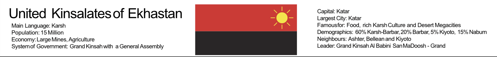
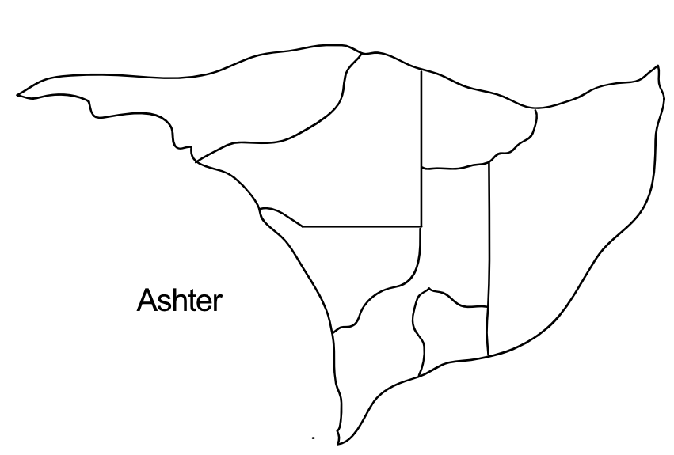
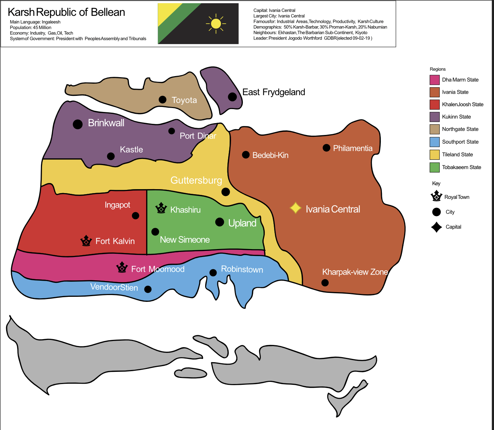
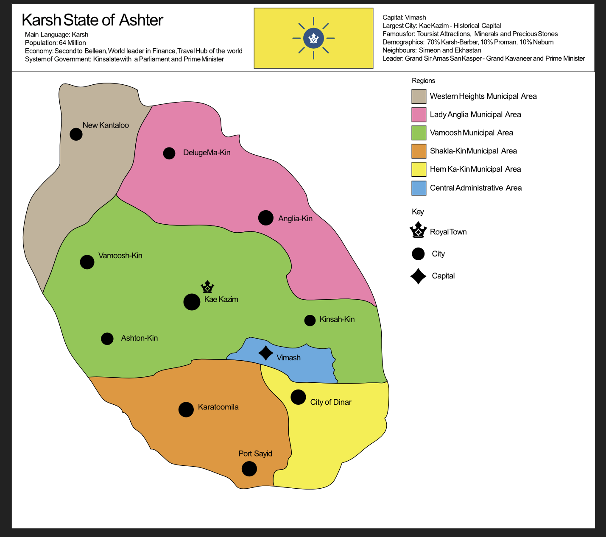

The game starts with some countries. Users will be able to create new countries and cultures later.

The starting countries and their cultures are:

Cultures:

- Karsh
  Countries: The Karsh Republic of Bellean, United Kinsalates of Ekhastan, Karsh State of Ashter

  
  
  
  

- Kev:
  Countries: The Free State of Kev
  States: 1. Storr - (1,500,000) e 2. Stonkev - (3,500,000) t 3. Sdev - (5,000,000) e 4. Pregge - (7,000,000) t 5. Potgregge - (9,000,000) e 6. Pooventt - (1,500,000) t 7. Midu - (15,000,000) e 8. Manitobva - (10,000,000) e 9. Jacwinth - (10,000,000) t 10. Feedhein - (6,000,000) t 11. Damwinth - (10,000,000) t
  Ceviva - (10,500,000) e

- Legardio:
  Countries: The Royal Kindred of Simeon
- Hunterlaan:
  Countries: Hunterland
- Inga:
  Countries:
  The United Provines of Palaba, The Republic of Galli

        Palaba's States (Provinces):
        1. Ematob
        2. Joshenkaal
        3. Bellarea
        4. Palaba Central
        5. New Dinan
        6. Nushigam
        7. Kishin
        8. Paking
        9. Fridgeland
        10. Southgate
        11. Woodinsborrow
        12. Rushma
        13. Southend
        14. Nabum Semi-Autonomous Region
        15. Flowerpoht

- Kiyoto:
  - Kiyoto

Use these cultures and the existing Places list and Player names to formulate the starting point of the games culture system.

In the future, players will be able to creat enew cultures and countries.
