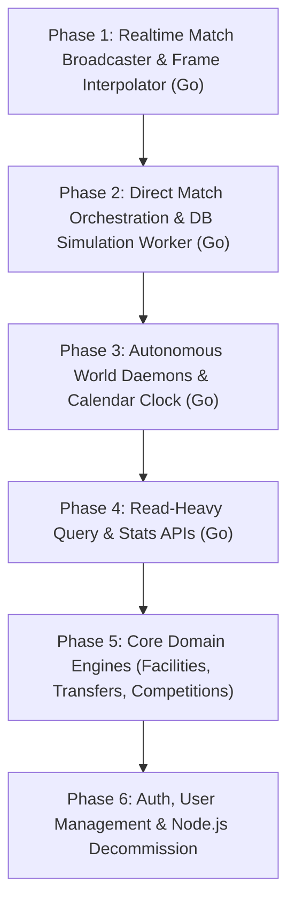

# FS-PRO Go Server Rewrite: Master Architectural Plan

## 1. Executive Summary & Vision

This document outlines the master architectural plan to incrementally migrate the current **TypeScript backend server** (`apps/fs-pro-server`, ~40,000 lines of code) to **Go**, while maintaining:
1. **Rust (`sim-core`)** as the high-performance, deterministic match simulation core.
2. **Vue 3 (`fs-pro-client`)** as the reactive browser presentation layer.
3. **PostgreSQL** (30 existing schema tables) as the single source of truth throughout the migration.

The migration follows the **Strangler Fig Pattern**: Go services and the legacy Node.js server run concurrently on the exact same database. Traffic is shifted incrementally subsystem-by-subsystem behind a reverse proxy gateway. There is **zero downtime**, **zero big-bang rewrite risk**, and each phase is independently testable and reversible.

---

## 2. Target System Architecture

```
                                  ┌─────────────────────────────┐
                                  │   Vue 3 Frontend (Client)   │
                                  │  (Pitch Visualizer & UI)    │
                                  └──────────────┬──────────────┘
                                                 │
                                                 │ HTTPS / WSS
                                                 ▼
                                  ┌─────────────────────────────┐
                                  │    API Gateway / Proxy      │
                                  │    (Nginx or Go Gateway)    │
                                  └──────┬───────────────┬──────┘
                                         │               │
               Migrated Endpoints & WS   │               │ Legacy Fallback
                                         ▼               ▼
                       ┌─────────────────────────┐   ┌─────────────────────────┐
                       │    Go Backend Server    │   │   Node.js Legacy Server │
                       │    (Fast, Goroutines)   │   │   (Express / Drizzle)   │
                       └───────────┬─────────────┘   └───────────┬─────────────┘
                                   │                             │
             Direct In-Process CGO │                             │
             or Local Socket       │                             │
                                   ▼                             │
                       ┌─────────────────────────┐               │
                       │    Rust Sim Core DLL    │               │
                       │   (crates/sim-core)     │               │
                       └─────────────────────────┘               │
                                   │                             │
                                   ▼                             ▼
                       ┌───────────────────────────────────────────────┐
                       │             PostgreSQL Database               │
                       │          (30 Tables - Drizzle / pgx)          │
                       └───────────────────────────────────────────────┘
```

---

## 3. Subsystem Breakdown & Migration Inventory

| Subsystem | Current TS Path | LOC | Migration Complexity | Target Go Architecture |
| :--- | :--- | :--- | :--- | :--- |
| **1. Match Realtime Streaming** | `src/realtime/` | 685 | **Low** | Expand `apps/fs-pro-realtime` or `services/sim-service` with Go WebSockets & frame interpolation |
| **2. Match Simulation Worker** | `src/jobs/` + `controllers/game/` | 1,211 | **Low** | Move directly into `services/sim-service` (Go talks straight to Postgres & loads `sim_core.dll`) |
| **3. Background World Daemons** | `src/services/world/`, `calendar/`, `facilities/` | 4,965 | **Medium** | Dedicated Go worker daemon (`world-worker`) using `time.Ticker` & DB advisory locks |
| **4. Read-Heavy Query APIs** | `controllers/fixtures/`, `rankings/`, `replays/` | 1,850 | **Low** | Go HTTP endpoints powered by `chi` + `jackc/pgx/v5` / `sqlc` |
| **5. Complex Domain Engines** | `services/competitions/`, `transfers/`, `facilities/` | 7,346 | **Medium-High** | Domain-driven Go packages (`domain/competitions`, `domain/market`, `domain/campus`) |
| **6. User Auth & Session Gateway**| `controllers/auth/`, `middleware/`, `sessionStore` | 2,420 | **Low-Medium** | Go cookie session middleware & bcrypt auth handlers |

---

## 4. Phased Migration Roadmap

The migration is divided into **6 sequential phases**, ordered to maximize early performance gains while minimizing regression risk:



1. **[Phase 1: Realtime Match Streaming](01-MIGRATION-PHASES.md#phase-1-realtime-match-broadcaster--frame-interpolator)**
   - Eliminates WebSocket CPU/memory pressure on Node.js single-thread event loop.
   - Go expands frames and streams tick-by-tick at 60ms broadcast pace with zero GC pressure.
2. **[Phase 2: Direct Match Orchestration](01-MIGRATION-PHASES.md#phase-2-direct-match-orchestration--db-simulation-worker)**
   - Eliminates the double HTTP hop: `Node -> Go -> Rust -> Go -> Node -> Postgres`.
   - Go `sim-service` reads squad lineups directly from Postgres, simulates via `sim_core.dll`, and commits results directly.
3. **[Phase 3: World Daemons & Calendar Clock](01-MIGRATION-PHASES.md#phase-3-background-world-daemons--calendar-clock)**
   - Replaces Node `setInterval` timers with rock-solid Go goroutines and PostgreSQL advisory locks.
   - Runs autonomous AI club matches, facility construction ticks, and world calendar advances.
4. **[Phase 4: High-Throughput Read APIs](01-MIGRATION-PHASES.md#phase-4-read-heavy-query--stats-apis)**
   - Stateless read routes (`/api/fixtures`, `/api/match-replays`, `/api/rankings`, `/api/calendar`).
   - Delivers 10x–20x throughput gains using type-safe `sqlc` / `pgx`.
5. **[Phase 5: Core Domain Engines](01-MIGRATION-PHASES.md#phase-5-core-domain-engines)**
   - Ports domain business rules: Facilities & Campus grids, Transfer Market bidding, Competition trees & promotions.
6. **[Phase 6: Auth & Node Decommission](01-MIGRATION-PHASES.md#phase-6-auth-user-management--node-decommission)**
   - User authentication, session cookie validation, final route cutover, and decommissioning of the Node.js process.

---

## 5. Architectural Documents Directory

Detailed specifications for each aspect of the rewrite:

- [`01-MIGRATION-PHASES.md`](./01-MIGRATION-PHASES.md) — Comprehensive technical implementation plan for each phase.
- [`02-ARCHITECTURE-AND-STANDARDS.md`](./02-ARCHITECTURE-AND-STANDARDS.md) — Go tech stack, project structure, database access (`sqlc`), and coding standards.
- [`03-VERIFICATION-AND-ROLLBACK.md`](./03-VERIFICATION-AND-ROLLBACK.md) — Parity testing, dual-run verification, benchmarks, and rollback protocols.
